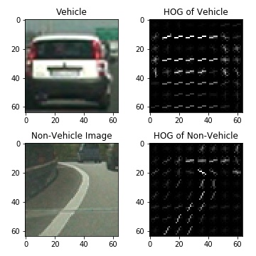
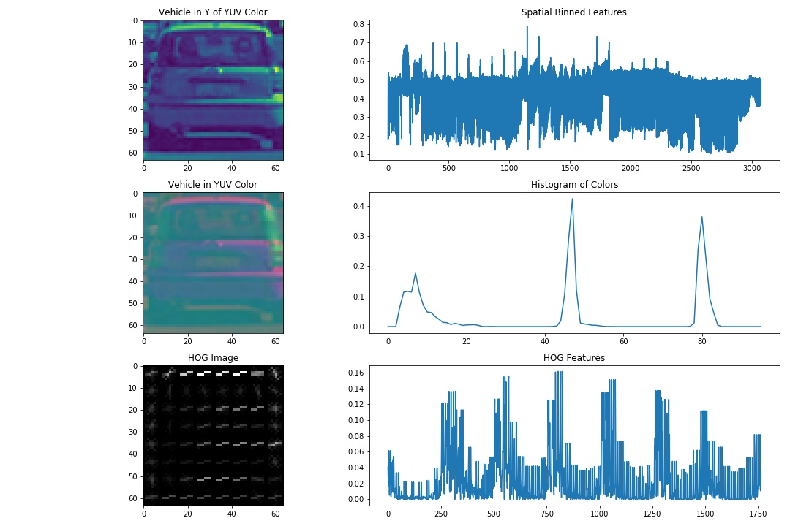
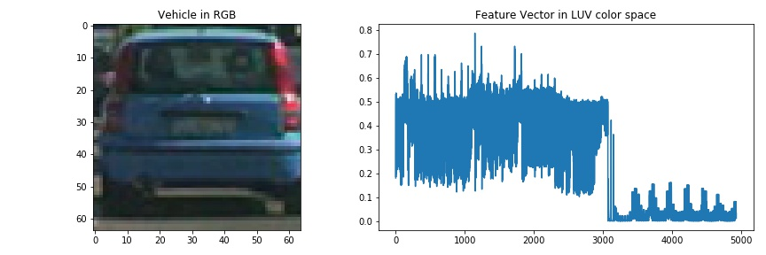
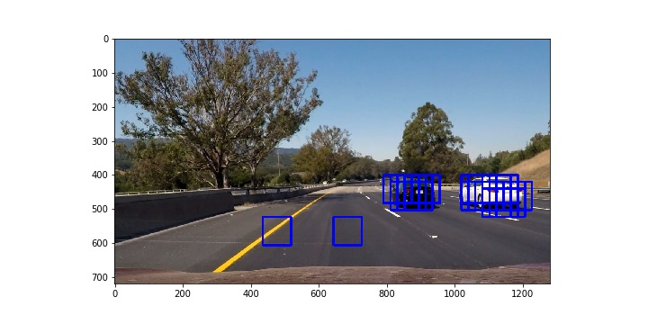
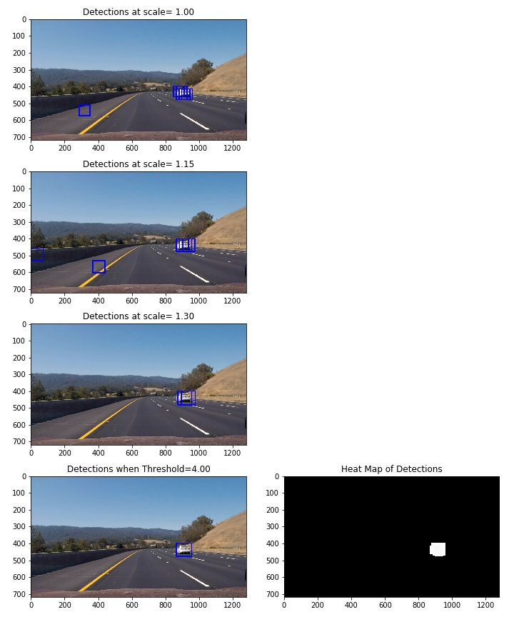
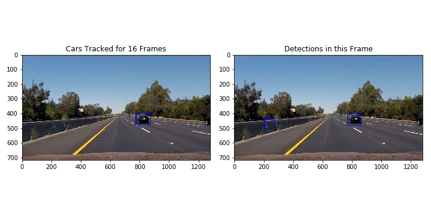

## **Vehicle Detection Project**

The goal of this project is to find and track vehicles in a video stream.

#### The following steps were taken to accomplish this task.
* Perform a Histogram of Oriented Gradients (HOG) feature extraction on labeled training images.
* Create a feature vector of HOG features, spatially binned colors and histogram of colors.
* Train a Linear SVM classifier on the feature vectors.
* Implement a sliding-window technique and use the trained SVM classifier to search for vehicles in an image.
* Write a pipeline to processes a video stream and create a heat map of recurring detections to find and follow vehicles.
* Estimate a bounding box for the vehicles detected.
* Process test_video.mp4 and the project_video.mp4 using the pipeline to track vehicles with bounding boxes.

The python code for accomplishing this project is included in the accompanying jupyter notebook.  A number of the functions in the jupyter notebook were taken or motivated from the class section on Object Detection.  

### Histogram of Oriented Gradients (HOG)

The HOG analysis of an image is a very useful way to detect its features. The HOG method divides an image into local regions and then identifies the strongest gradient or edge within that cell.  To find the strongest gradient, a histogram of the gradients is created where they are binned by their orientation, and weighted by their magnitude.  Groups of the cells are then normalized.  This reduces sensitivity to illumination and contrast thereby improving the algo.  A more detailed description can be found at http://scikit-image.org/docs/dev/auto_examples/features_detection/plot_hog.html and https://en.wikipedia.org/wiki/Histogram_of_oriented_gradients. 

For this study, the hog algorithm skimage.feature.hog() from scikit-image was used.  Images of vehicles and non-vehicles of 64x64x3 pixels in shape were analyzed.  The parameters for the HOG algorithm were set at cells of 8x8 pixels, 9 channel histogram of the gradient orientation (20$^\circ$ per bin), and block normalization over 2x2 cells with block_norm=L2-Hys.  Normalization of the whole image with power law compression (transform_sqrt) before processing was not used since it did not improve the results. Larger blocks of 3x3 cells and other block norm algos were also investigated but not used.

An example of a histogram of gradients is shown below for a vehicle and a non-vehicle image.  

### Feature Vectors
To obtain a description of each image, a vector of its features was created.  This feature vector had 3 parts:
1. Spatially Binned Colors:  The image was resized to 32x32 and then a vector of its pixel values where they are found within the image was created.
2. Histogram of Colors:  A histogram of the colors in the image was made.  The colors (0-255) were divided into 32 bins, and the count of pixels whose values lie within each bin was made.
3. HOG features:  A vector of HOG features as described in the section above was calculated.

For this project, the image was first transformed from the RGB (Red-Green-Blue) to the YUV color space.  This color space was chosen since the classification algorithm yielded fewer false positives. 

An example of each component of the feature vector is shown below.

To scale each method for visualization purposes, values in #1 were divided by 255, values in #2 were divided by 4096, and values in #3 were multiplied by 5. 

An example of the full feature vector is show below.

Several functions were used to obtain the features vectors from image files.  The function extract_feats_from_files() called the function extract_features() which called the functions convert_color(), bin_spatial(), color_hist() and get_hog_features(). 

### SVM Classifier
To determine whether an image is a vehicle or non-vehicle, a linear SVM classifier was used.  This linear SVM classier was fit on the feature vectors of the labeled images where the classes were vehicles=1 and non-vehicles=0.  Before the fit was performed, the feature vectors were normalized to zero mean and unit standard deviation using the sklearn.preprocessing.StandardScalar() function.  The normalized data was randomized and then split using the 80/20 principal, where 80% was used for training, and 20% for testing.  

A total of 8792 vehicle images, and 8968 non-vehicle images were used to train the classifier.  The accuracy on the training set was close to 100% and the accuracy on the test set was nearly 99%.

### Sliding Window Search
To search for cars in an image, the function find_cars() was used.  This function runs the HOG algorithm once on the whole image.  It then searches the image using sliding windows.  For each sliding window, it creates a feature vector, normalizes the vector and then calls the svm classifier to determine whether it is a vehicle or not.  

To choose the size of the sliding window, it starts with a 64x64 sized window in the top left corner. It then shifts the window down 2 cells or 16 pixels (with HOG, each cell is 8x8 pixels). Once the left-most column is covered, it shifts 2 cells to the right to the next column and processes that column from top to bottom.  This is done until the whole image has been covered with the sliding windows.

To search using a different size of sliding windows, a scale parameter is used.  The image is resized to height/scale x width/scale and the resized image is searched as described above.  Setting the scale to 1.5 would change the sliding window size to 96x96.

The coordinates of any windows classified as a vehicle is returned in a list.  An example using scale=1.3 or windows of 83x83 is shown below with the blue boxes representing windows classified as vehicles.

### Pipeline
To detect and track cars, the pipeline function track_cars() was written.  This function processes an image and then uses information from previous frames to identify and track cars.

The pipeline starts by first searching an image for vehicles using three different scales (1.00, 1.15 and 1.30) of sliding windows within the road area (pixels 400 through 680 in the vertical direction).

Windows classified as vehicles are recorded and are combined using a heat map where each detection adds a value of 1 to its pixel values.  To qualify as a valid detection, a pixel must be in at least 4 postive window matches.  The function scipy.ndimage.measurements.label() is then used on the heat map to identify and label the hot spots or cars.  A bounding box for each hot spot is found using the function get_label_boxes().  The bounding boxes are then inspected by the function rm_small_boxes() which discards any boxes whose length or width is less than 48 pixels.  Removing these small boxes helped reduce false positives.

An example of the search in one frame, and the heat map is shown below.

The detections from the image are then added to the class ObjectBoxes which maintains a list of the detections from the last 16 frames.  These detections are then added together again using a heat map.  A minimum of 14 overlapping detections are now required to qualify as a tracked car.  This period of length was used to avoid false positives from yellow lanes, guard rails and dividers.  Hot spots are labeled using the scipy.ndimage.measurements.label() functon, and the functions get_label_boxes() and rm_small_boxes() are called to get the boxes for the tracked cars.

An example of this is shown below with the tracked car on the left and the car detections from the last frame on the right.

### Videos
Two videos were processed using this pipeline.  The first was a short [test video](writeup_videos/test_video.mp4) and the second was a longer [project video](writeup_videos/project_video.mp4).

### Potential issues
* The biggest issue was with false positives.  This happened frequently on dark patches of pavement, yellow lines and guard rails.  Fitting the classier on a larger set of data (with more guard rails and yellow lines) should reduce these errors. 
* The algorithm was slow to pick up cars entering the field of view, especially with the fast-moving vehicle at the end of the project video.  This is due to the requirement of positive identification in at least 14 frames before it tracks the vehicle.
* This pipeline is also slow taking around 2-3s to process each frame on a fast cloud machine.  This is too slow to be done in real-time and also limited the research process.

### Possible improvements.
* Fit the classier on a larger set of data (with more guard rails and yellow lines) to reduce false positives.  
* Increase the speed of the algorithm by using a smarter search grid based on information from earlier dectections.  Running the window search algorithm on every other frame should work as well since little changes between frames.
